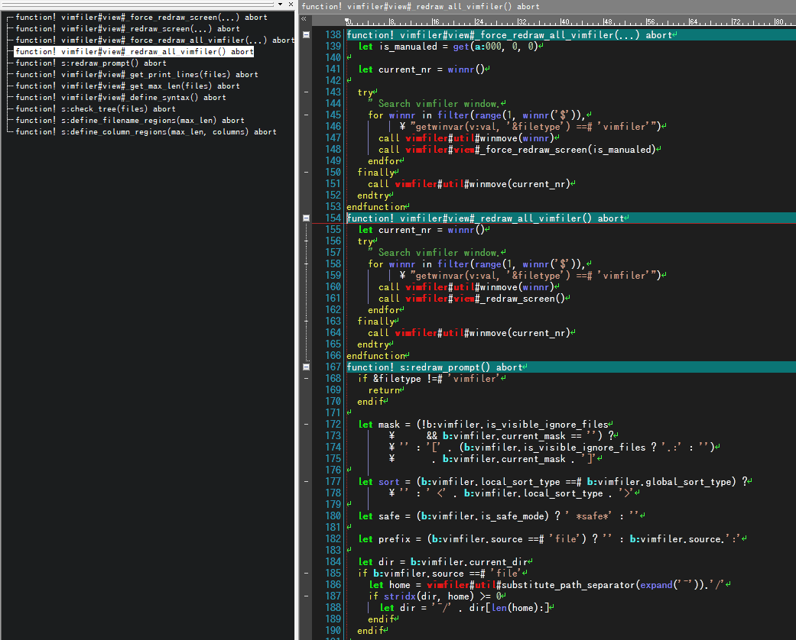

# 秀丸エディタのハイライト設定集

- [Vim scriptの強調表示](#vim-scriptの強調表示)
- [Shell Script(Bash)の強調表示](#shell-scriptbashの強調表示)
- [MaxScript(Autodesk社 3D Studio MAX)の強調表示](#maxscriptautodesk社-3d-studio-maxの強調表示)
- [ダウンロード](#ダウンロード)
- [連絡先](#連絡先)

# Vim scriptの強調表示

VIMスクリプトのコードリーディングを主目的として以下方針で作成しました。

- 文字列とコメントは正確に強調する
- それ以外は多少の間違いを許容する

スクリーンショット

## 強調するもの

- 組み込み関数
- コマンド
- 制御構文
- 変数スコープ
- ネームスペース
- 関数

## ファイル

vim.hilight

## 補足

強調表示定義ファイルを読み込むときに「カラー」を選択すると、上のスクリーンショットと同じ配色になります。

# Shell Script(Bash)の強調表示

## ファイル

shell.hilight

# MaxScript(Autodesk社 3D Studio MAX)の強調表示

## ファイル
maxscript.hilight

# ダウンロード

[hilightフォルダ](hilight)から必要なファイルをダウンロードしてください。

# 連絡先

http://d.hatena.ne.jp/ohtorii/  
https://twitter.com/ohtorii  

